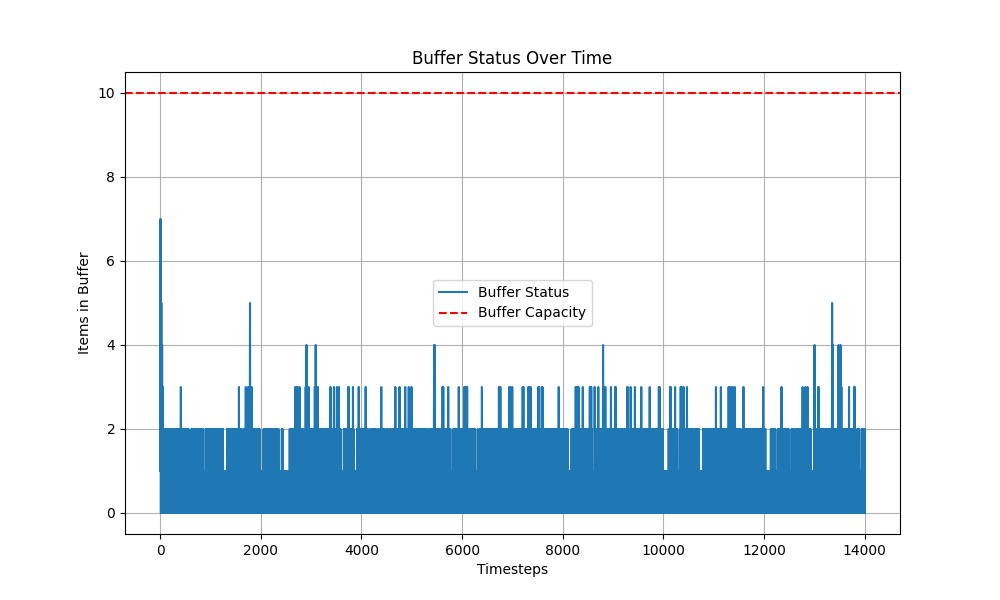

# Sistema de Controle para Linha de Produção Industrial

Este projeto simula uma linha de produção industrial automatizada usando Python. Ele utiliza múltiplos produtores e consumidores que interagem com um buffer compartilhado, controlando o acesso e sincronização através de threads, semáforos e mutex. O objetivo é modelar a dinâmica de um sistema real de produção e consumo com capacidade limitada de armazenamento.

## Estrutura do Projeto

O projeto é dividido em três partes principais:

### 1. **Buffer Compartilhado**
   - Um buffer de capacidade limitada é utilizado para armazenar as peças produzidas.
   - O buffer controla a adição e remoção de peças pelos produtores e consumidores, respeitando o limite de capacidade e prevenindo condições de corrida.

### 2. **Produtores e Consumidores**
   - **Produtores:** Geram peças e tentam adicioná-las ao buffer. Caso o buffer esteja cheio, eles esperam até que haja espaço disponível.
   - **Consumidores:** Retiram peças do buffer para consumi-las. Caso o buffer esteja vazio, eles esperam até que haja peças disponíveis.
   - Cada thread é sincronizada para garantir que a produção e o consumo ocorram em ciclos organizados.

### 3. **Resultados e Relatórios**
   - Durante a execução, o programa coleta os dados de produção e consumo ao longo dos ciclos (timesteps).
   - Ao final da execução, são gerados:
     - Um relatório em Markdown (`report.md`) contendo o total de itens produzidos, consumidos e o máximo de itens no buffer.
     - Um gráfico em linha (`buffer_usage.png`) mostrando o número de itens no buffer ao longo do tempo.
     - Um arquivo CSV (`buffer_data.csv`) registrando a quantidade de itens no buffer em cada timestep.

   **Exemplo de Gráfico:**
   

## Executando o Projeto

1. **Pré-requisitos:**
   - Certifique-se de ter o Python 3.x instalado.
   - Instale o `matplotlib` se ainda não estiver disponível:
     ```bash
     pip install matplotlib
     ```

2. **Estrutura de Arquivos:**
   - `src/main.py`: Arquivo principal que gerencia o fluxo do sistema.
   - `src/producer_consumer.py`: Implementação das classes de produtores e consumidores.
   - `src/buffer.py`: Implementação do buffer com controle de capacidade.
   - `results/`: Pasta onde os relatórios e gráficos serão salvos.

3. **Executando o Sistema:**
   - Navegue até a pasta do projeto e execute:
     ```bash
     python src/main.py
     ```

4. **Resultados:**
   - Durante a execução, o terminal exibirá as operações realizadas pelos produtores e consumidores.
   - Após a conclusão, verifique a pasta `results/` para acessar os seguintes arquivos:
     - `report.md`: Relatório com os resultados.
     - `buffer_usage.png`: Gráfico de uso do buffer.
     - `buffer_data.csv`: Dados do buffer por timestep.

## Contribuições
Contribuições são bem-vindas! Sinta-se à vontade para abrir issues ou enviar pull requests com sugestões de melhorias.

## Licença
Este projeto está licenciado sob a MIT License.

## Time do Projeto
   - Dilermando Afonso
   - Labelle Cândido
   - Michael Azevedo
   - Rafael "A lenda" Diniz
